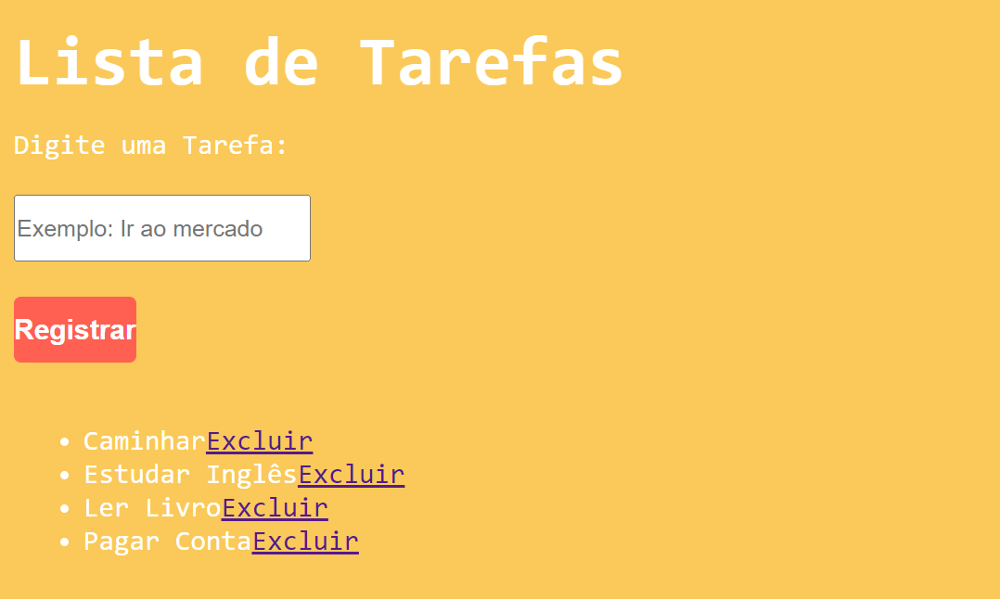

<h1 align="center"> Lista de Tarefas </h1>

Programa desenvolvido durante os estudos do curso Fabrica de Aplicativos - Sujeito Programador. 

  <a href="#-tecnologias">Tecnologias</a>     |    
  <a href="#-projeto">Projeto</a>     |    
  <a href="#-licença">Licença</a>

  

 

  

## 🚀 Tecnologias

Esse projeto foi desenvolvido com as seguintes tecnologias:

- HTML e CSS
- JavaScript
- Git e Github
- Visual Studio Code

## 💻 Projeto

O projeto Lista de Tarefas é uma página web que cadastra, exclui e salva informações no navegador local, podendo ser feito uma lista não ordenada de itens salvo e acessado no mesmo navegador a qualquer momento.

- [ Visite o projeto online ]()

## ✅ Licença

Esse projeto está sob a licença MIT.

---

Feito com 🧡 por Felipe Seidi Harakawa, durante o curso Fabrica de Aplicativos - Sujeito Programador. [ Visite o site! ](https://sujeitoprogramador.com/fabricadeaplicativos)
